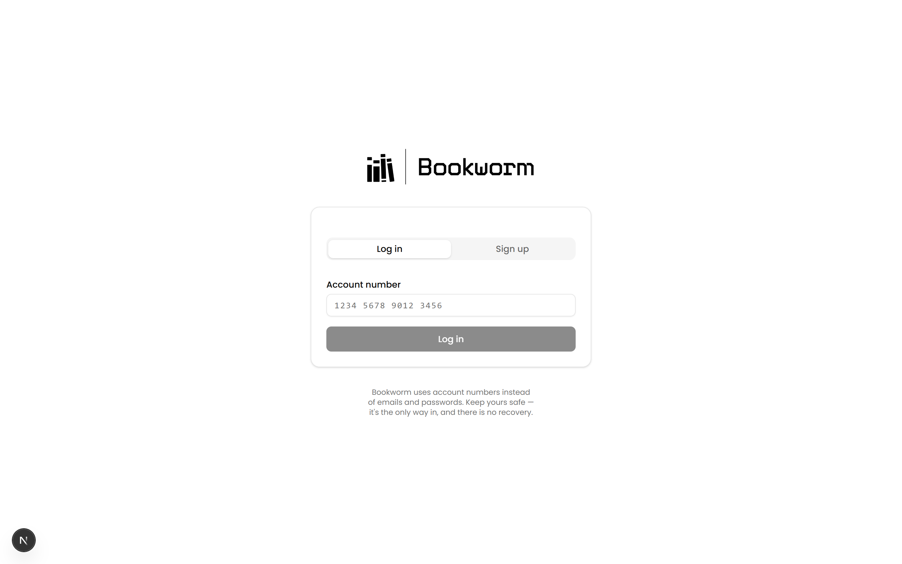
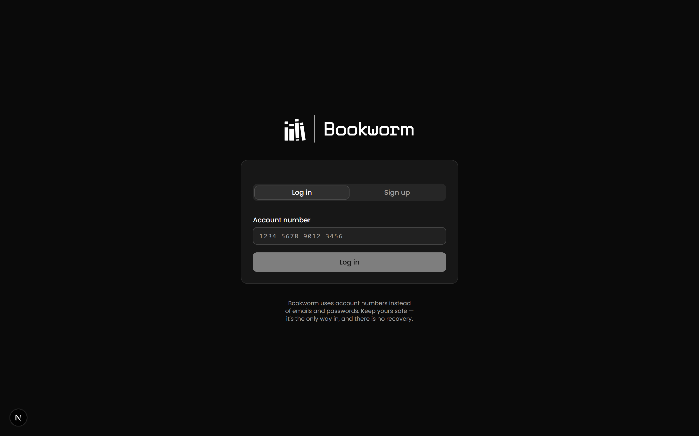

<h1 align="center">Bookworm</h1>

<p align="center">
  <strong>A private, token-keyed book library.</strong>
  <br/>
  Save what you've read, wishlist what you want to read, and search Google Books + weekly NYT Best Sellers.
  <br/>
  No email. No password. Just a 16-digit account number you keep somewhere safe — inspired by Mullvad VPN.
</p>

<p align="center">
  <a href="https://nextjs.org"></a>
  <a href="https://react.dev"></a>
  <a href="https://www.typescriptlang.org"></a>
  <a href="https://tailwindcss.com"></a>
  <a href="https://neon.tech"></a>
  <a href="https://orm.drizzle.team"></a>
  <a href="LICENSE.md"></a>
</p>

<p align="center">
  
</p>

---

## Why Bookworm?

Bookworm is an open-source book-library web app built on **Next.js 16 (App Router)**, **React 19**, and **TypeScript strict**. It was rebuilt from the ground up in 2026 as a reference implementation for the modern Next.js stack, with a few things that are hard to find working together in one place:

- **Mullvad-style account-number authentication** in a serverless Next.js app — no email, no password, no recovery flow, and the UX is a single 16-digit credential you paste to log in.
- **Next.js 16 Server Actions + Drizzle ORM + Neon Postgres** on the Vercel Marketplace, with migration scripts and a warm-up Vercel Cron.
- **Tailwind CSS v4 + shadcn/ui** with a genuine mobile-first responsive layout (bottom tabs under `md:`, sidebar above).
- **Daily-cached third-party APIs** (Google Books, NYT Best Sellers) via `unstable_cache` and a scheduled pre-warm.

If you're looking for a working example of any of those, start in [`lib/auth/`](lib/auth), [`db/schema.ts`](db/schema.ts), or [`app/(app)/books/actions.ts`](app/\(app\)/books/actions.ts).

## Features

- **Personal library** — add any book, rate it 1–5, remove it.
- **Wishlist** — save books to read later; move them to the library in one click.
- **Smart search** — Google Books queries with edition deduplication, thumbnail-preferring ranking, quoted-phrase boosting, and `intitle:` / `inauthor:` / `isbn:` / `subject:` operators.
- **Discover** — live NYT hardcover-fiction best sellers, refreshed server-side every 24 hours.
- **Book detail dialog** — cover, description, publisher, publish date, page count, ISBN, average rating, plus always-visible sticky action buttons.
- **Account-number login** — 16-digit credential generated at signup, argon2id-hashed, shown once, never recoverable.
- **Mobile + desktop responsive** — bottom tab bar on phones, sidebar on desktop, safe-area handling for iOS.
- **Light + dark mode** — `next-themes` with toggle in the user menu and settings.
- **Accessible by default** — Radix primitives under shadcn/ui, `prefers-reduced-motion` respected on the marquee, semantic landmarks throughout.

## Screenshots

### Landing page

| Desktop — light | Desktop — dark |
| :-------------: | :------------: |
|  |  |

| Mobile — light | Mobile — dark |
| :------------: | :-----------: |
|  |  |

### Authentication

| Desktop — light | Desktop — dark |
| :-------------: | :------------: |
|  |  |

> Screenshots are generated by running `yarn screenshots` against a local dev server (see [scripts/screenshots.ts](scripts/screenshots.ts)).

## Tech stack

| Layer | Choice |
| ----- | ------ |
| Framework | [Next.js 16](https://nextjs.org) — App Router, Server Actions, Server Components |
| Runtime | [React 19](https://react.dev) |
| Language | [TypeScript](https://www.typescriptlang.org) with `strict: true` and `noUncheckedIndexedAccess` |
| Styling | [Tailwind CSS v4](https://tailwindcss.com) + [shadcn/ui](https://ui.shadcn.com) (Radix primitives) |
| Database | [Neon Postgres](https://neon.tech) via the Vercel Marketplace |
| ORM | [Drizzle](https://orm.drizzle.team) + drizzle-kit |
| Auth | Custom token flow with [argon2id](https://github.com/napi-rs/node-rs) |
| Forms | [react-hook-form](https://react-hook-form.com) + [Zod](https://zod.dev) |
| Icons | [lucide-react](https://lucide.dev) |
| Toasts | [sonner](https://sonner.emilkowal.ski) |
| Theme | [next-themes](https://github.com/pacocoursey/next-themes) |
| Deployment | [Vercel](https://vercel.com) (Node runtime, Vercel Cron) |

## Quick start

```bash
git clone https://github.com/ahnafnafee/Bookworm
cd Bookworm
yarn install
cp .env.example .env.local
# Fill in DATABASE_URL, DATABASE_URL_UNPOOLED, NYT_API_KEY, CRON_SECRET
yarn db:migrate
yarn dev
```

Open [http://localhost:3000](http://localhost:3000).

### Environment variables

| Variable | Purpose |
| -------- | ------- |
| `DATABASE_URL` | Pooled Neon connection string (runtime queries) |
| `DATABASE_URL_UNPOOLED` | Direct Neon connection (migrations + Drizzle Kit) |
| `NYT_API_KEY` | NYT Books API key — get one from the [NYT developer portal](https://developer.nytimes.com) |
| `GOOGLE_BOOKS_API_KEY` | Optional; unauthenticated calls still work with a lower quota |
| `CRON_SECRET` | Shared secret for `/api/cron/warm-nyt` (`openssl rand -hex 32`) |
| `NEXT_PUBLIC_SITE_URL` | Optional absolute URL used in `og:*` metadata |

### Scripts

| Command | What it does |
| ------- | ------------ |
| `yarn dev` | Next.js dev server with HMR |
| `yarn build` | Production build |
| `yarn start` | Serve the production build |
| `yarn typecheck` | `tsc --noEmit` |
| `yarn lint` | Next.js ESLint (flat config) |
| `yarn db:generate` | Generate SQL migrations from `db/schema.ts` |
| `yarn db:migrate` | Apply generated migrations (safe, idempotent) |
| `yarn db:push` | Drizzle Kit push (interactive; prefer `db:migrate`) |
| `yarn db:studio` | Drizzle Studio |

## How it works

### Authentication — Mullvad-style account numbers

Bookworm has no password field. Signup generates a 16-digit CSPRNG account number using `crypto.randomInt`; the number is shown to the user **once** and never recoverable.

**Storage — split-token pattern:**

- `token_lookup` = first 6 digits, stored plaintext, unique-indexed. Narrows any login to a single row.
- `token_hash` = argon2id hash of the remaining 10 digits. Verified against that one row in constant time.

Plain bcrypt on the whole 16-digit token would force an O(n) scan of every user to find the right row. Plain SHA-256 would be indexable but catastrophic on DB leak. The split pattern fixes both: one indexed lookup, one memory-hard verify.

**Sessions:**

Opaque 32-byte `session_id` in an `HttpOnly; Secure; SameSite=Lax` cookie. Session row lives in Postgres with a 30-day TTL, rotated every 7 days on touch. Logout deletes the row immediately. A JWT could work but can't be revoked — opaque IDs can.

**Defense-in-depth:**

The proxy (`proxy.ts` — Next.js 16 renamed the `middleware` file convention) does UX redirects only; it is not a security boundary ([CVE-2025-29927](https://nvd.nist.gov/vuln/detail/CVE-2025-29927) shows why). Every server action and every data fetch calls `requireUser()`, which re-verifies the session against the DB. See [`lib/auth/session.ts`](lib/auth/session.ts).

### Caching + rate limits

| Where | TTL | Why |
| ----- | --- | --- |
| `getBestSellers()` | 24 h | NYT lists update weekly; 1/day cron re-warm |
| `searchGoogleBooks()` | 10 min | Per-query cache; most users repeat queries |
| `getGoogleBookDetail()` | 24 h | Book details rarely change |
| `resolveNytBook()` | 7 days | NYT-to-Google mapping is stable |

A **Vercel Cron** hits `/api/cron/warm-nyt` daily at 06:00 UTC, calls `revalidateTag("nyt")`, and refetches so the first real visitor of the day never pays the NYT latency.

Rate limits (in [`lib/auth/rate-limit.ts`](lib/auth/rate-limit.ts)): signup 20/hour per IP, login 10/minute per IP, book-detail fetch 120/minute per user, NYT resolve 60/minute per user.

### Search quality

The search pipeline does four things beyond a raw Google Books call, in [`lib/books/google.ts`](lib/books/google.ts):

1. **Query preprocessing** — when no field prefix (`intitle:`, `inauthor:`, `isbn:`, `subject:`, `inpublisher:`) is detected, the query is wrapped in `"…"` for exact-phrase ranking.
2. **Edition deduplication** — results with the same normalized `title|firstAuthor` are collapsed; the one with the better cover + rating wins.
3. **Thumbnail-preferring sort** — results with covers bubble to the top.
4. **Field operators exposed to users** — type `intitle:dune`, `inauthor:"ursula le guin"`, or `isbn:9780747532743` directly.

### Project layout

```
app/
  (app)/                 authed routes (library, search, wishlist, settings)
  (app)/books/actions.ts book mutations (add/remove/rate/move)
  (auth)/actions.ts      signup, login, logout server actions
  api/cron/warm-nyt/     Vercel Cron hook
  authenticate/          tabbed signup + login + show-once token screen
  layout.tsx             root layout, Poppins via next/font, theme, toaster
  page.tsx               landing with multi-row cover marquee
components/
  app/                   feature components (book card, marquee, nav, dialog)
  auth/                  signup, login, token-display
  ui/                    shadcn/ui primitives (your source)
db/
  schema.ts              Drizzle schema (users, sessions, books, wishlist, rate_limits)
  migrations/            generated SQL
lib/
  auth/                  token, hash, session, rate-limit
  books/                 Google Books + NYT clients (server-only)
proxy.ts                 UX redirect gate (Next 16's renamed middleware)
vercel.json              cron schedule
```

## Deploying to Vercel

1. Push this repo to GitHub.
2. Import the repo in Vercel.
3. **Storage → Marketplace → Neon → Create Database** — this auto-wires `DATABASE_URL` and `DATABASE_URL_UNPOOLED` into the project env.
4. Add `NYT_API_KEY`, `GOOGLE_BOOKS_API_KEY` (optional), and `CRON_SECRET` in **Project → Settings → Environment Variables** for Production + Preview + Development.
5. Deploy. Vercel detects [`vercel.json`](vercel.json) and registers the daily cron.
6. One-time migration against prod: `vercel env pull .env.production.local && yarn db:migrate`.

## Security notes

- Node runtime is enforced for routes that touch `@node-rs/argon2` (native bindings are not available on the Edge runtime).
- API keys never leave the server — Google Books search goes through a proxy route and NYT calls are always server-side.
- Session cookies are `HttpOnly; Secure; SameSite=Lax` and rotated every 7 days of activity.
- Rate limits on signup, login, book-detail fetch, and NYT resolve.
- No email, no password storage, no recovery flow — the 16-digit account number is the only credential.

## License

[MIT](LICENSE.md) © [Ahnaf An Nafee](https://github.com/ahnafnafee).

Book covers in screenshots come from the [Google Books API](https://developers.google.com/books) and the [NYT Books API](https://developer.nytimes.com/docs/books-product/1/overview); they are the property of their respective publishers and are shown here only for demonstration purposes.
